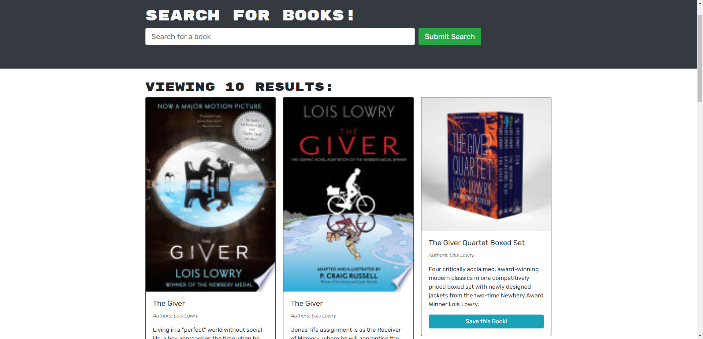

# Book Search Engine

[](https://opensource.org/licenses/MIT)


[check out the site!](https://sheltered-basin-40141.herokuapp.com/)

## Description 
This is an application that uses Google Books API as a search engine. I built this application to learn more about GraphQL API and building with Apollo Server. This app was built using a MERN stack, with a REACT front end, MongoDB database, and Node.js/Express.js server and API.



## Technology Used
* Express.js
* MongoDB
* Apollo Server
* GraphQL
* REACT
* Node.js

## Code Snippet 

Here is an example of a typeDef I used to define the User.

```JavaScript
type User {
    _id: ID
    username: String
    email: String
    password: String
    bookCount: Int
    savedBooks: [Book]
}
```
Here is a Query to get all users and to find users by id in my resolvers.js file
```JavaScript
 Query: {
    getAllUsers: async () => {
      return User.find();
    },
    me: async (parent, args, context) => {
      const foundUser = await User.findById(context.user._id);

      if (!foundUser) {
        throw new AuthenticationError("No user with this id");
      }

      return foundUser;
    },
  },
```


## Author Links 
* [Github](https://github.com/mattjgatsby)
* [LinkedIn](https://www.linkedin.com/in/matthew-gatsby-1a1521250/)